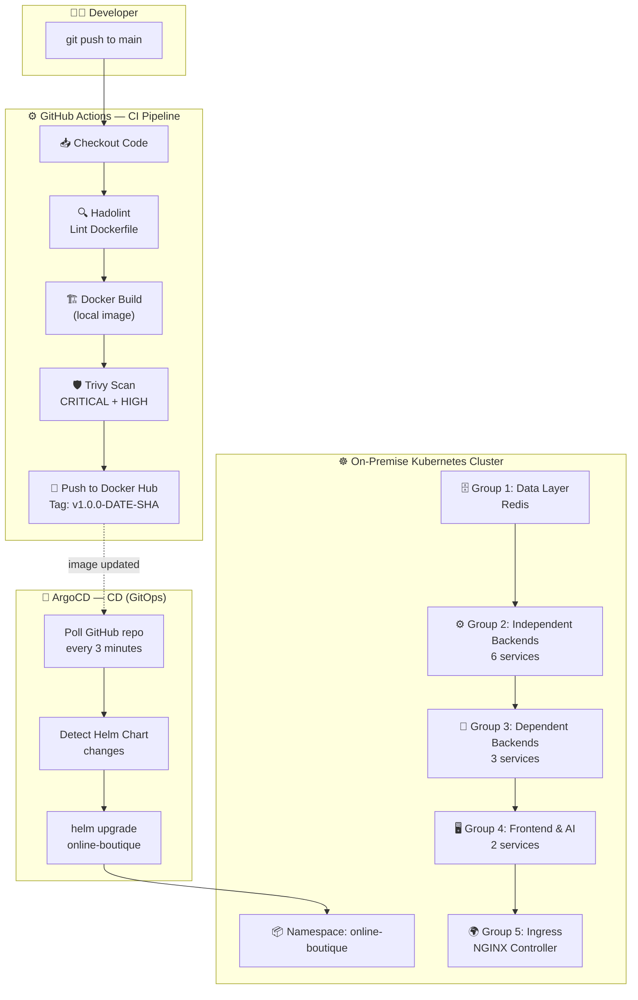

<p align="center">
  
  
  
  
  
  
</p>

# 🛒 Online Boutique — DevSecOps Microservices Platform

> **A production-grade, end-to-end DevSecOps implementation** deploying 12 cloud-native microservices onto an on-premise Kubernetes cluster, powered by a fully automated CI/CD pipeline with integrated security scanning.

---

## 📖 Project Overview

This project demonstrates a **real-world DevSecOps workflow** built on top of [Google's Microservices Demo (Online Boutique)](https://github.com/GoogleCloudPlatform/microservices-demo) — a polyglot e-commerce application consisting of **12 microservices** written in Go, Python, Java, C#, and Node.js.

**Key objectives:**
- ✅ Implement **GitOps-driven Continuous Deployment** using ArgoCD
- ✅ Build a **DevSecOps CI Pipeline** with Dockerfile linting (Hadolint) and container vulnerability scanning (Trivy)
- ✅ Package all services into a **Helm Chart** with ordered startup dependencies via `initContainers`
- ✅ Deploy to an **on-premise Kubernetes cluster** (no cloud dependency)
- ✅ Integrate **Gemini AI** as a Shopping Assistant service

---

## 🏛️ Architecture Diagram



> **CI** is Push-based (triggered by `git push`). **CD** is Pull-based (ArgoCD polls the Git repository) — ideal for clusters behind NAT/firewall since no inbound port is required.

---

## 🛠️ Tech Stack

| Layer | Technology | Purpose |
|---|---|---|
| **Application** | Go, Python, Java, C#, Node.js | 12 polyglot microservices |
| **AI** | Google Gemini API (`gemini-2.5-flash`) | Shopping Assistant chatbot |
| **Containerization** | Docker, Docker Hub (`kihpn1711/*`) | Build & store container images |
| **Orchestration** | Kubernetes (On-Premise, 3 nodes) | Container orchestration |
| **Packaging** | Helm Chart v1.0.0 | Templated K8s manifests with startup ordering |
| **CI** | GitHub Actions | Lint → Build → Scan → Push (11 parallel jobs) |
| **CD** | ArgoCD (GitOps, auto-sync) | Pull-based deployment with self-healing |
| **Security** | Trivy, Hadolint | Image vulnerability scan & Dockerfile linting |
| **Ingress** | NGINX Ingress Controller | Layer 7 traffic routing |
| **Reverse Proxy** | NGINX (external) | Load balancing across K8s nodes |

---

## 📁 Repository Structure

```
.
├── .github/workflows/
│   └── devsecops-ci.yml              # CI: 11-service matrix build pipeline
├── cicd/
│   ├── argocd-application.yaml       # CD: ArgoCD Application manifest
│   ├── argocd-values.yaml            # ArgoCD Helm install values
│   └── README.md                     # CI/CD setup guide
├── online-boutique-chart/            # Helm Chart (5-group startup ordering)
│   ├── Chart.yaml
│   ├── values.yaml                   # Centralized configuration
│   └── templates/                    # 15 K8s templates + helpers
│       ├── namespace.yaml
│       ├── redis-cart.yaml           # [Group 1] Data Layer
│       ├── adservice.yaml            # [Group 2] Independent Backends
│       ├── currencyservice.yaml      #   ...
│       ├── emailservice.yaml         #   ...
│       ├── paymentservice.yaml       #   ...
│       ├── shippingservice.yaml      #   ...
│       ├── productcatalogservice.yaml#   ...
│       ├── cartservice.yaml          # [Group 3] Dependent Backends
│       ├── recommendationservice.yaml#   ...
│       ├── checkoutservice.yaml      #   ...
│       ├── shoppingassistantservice.yaml # [Group 4] AI Service
│       ├── frontend.yaml             # [Group 4] Web UI
│       └── ingress.yaml              # [Group 5] Traffic Entry
├── kubernetes-manifests/             # Raw K8s manifests (Kustomize)
└── src/                              # Source code for 12 services
    ├── adservice/                    # Java (gRPC)
    ├── cartservice/                  # C# (.NET)
    ├── checkoutservice/              # Go
    ├── currencyservice/              # Node.js
    ├── emailservice/                 # Python
    ├── frontend/                     # Go (HTTP)
    ├── loadgenerator/                # Python (Locust)
    ├── paymentservice/               # Node.js
    ├── productcatalogservice/        # Go
    ├── recommendationservice/        # Python
    ├── shippingservice/              # Go
    └── shoppingassistantservice/     # Python (Gemini AI)
```

---

## 📋 Prerequisites

| Requirement | Version / Detail |
|---|---|
| **Kubernetes Cluster** | v1.25+ (on-premise, minimum 3 nodes recommended) |
| **kubectl** | Configured with cluster admin access |
| **Helm** | v3.12+ |
| **NGINX Ingress Controller** | Installed on the cluster |
| **GitHub Account** | With *Actions* enabled |
| **Docker Hub Account** | For image registry |
| **Gemini API Key** | From [Google AI Studio](https://aistudio.google.com/apikey) |
| **DNS / Hosts** | `online-boutique.kihpn.local` and `argocd.kihpn.local` pointed to your cluster |

---

## 🚀 Quick Start

### 1. Configure GitHub Secrets

Navigate to **GitHub Repo → Settings → Secrets and variables → Actions** and add:

| Secret Name | Description |
|---|---|
| `DOCKERHUB_USERNAME` | Your Docker Hub username |
| `DOCKERHUB_TOKEN` | Docker Hub Access Token ([generate here](https://hub.docker.com/settings/security)) |

### 2. Trigger CI Pipeline

```bash
git add .
git commit -m "feat: initial DevSecOps pipeline"
git push origin main
```

> GitHub Actions will automatically run **11 parallel build jobs** — each performing: Hadolint lint → Docker build → Trivy scan → Push to Docker Hub.

### 3. Create Kubernetes Secrets

```bash
# Namespace
kubectl create namespace online-boutique

# Docker Hub pull credentials
kubectl create secret docker-registry dockerhub-key \
  --docker-server=https://index.docker.io/v1/ \
  --docker-username=<YOUR_DOCKERHUB_USERNAME> \
  --docker-password=<YOUR_DOCKERHUB_TOKEN> \
  --namespace=online-boutique

# Gemini AI API Key
kubectl create secret generic gemini-api-key \
  --from-literal=GEMINI_API_KEY="<YOUR_GEMINI_KEY>" \
  --namespace=online-boutique
```

### 4. Install ArgoCD

```bash
helm repo add argo https://argoproj.github.io/argo-helm
helm repo update

helm install argocd argo/argo-cd \
  --namespace argocd \
  --create-namespace \
  -f cicd/argocd-values.yaml \
  --wait --timeout 5m

# Retrieve admin password
kubectl get secret argocd-initial-admin-secret -n argocd \
  -o jsonpath="{.data.password}" | base64 -d && echo
```

### 5. Deploy Application via ArgoCD

```bash
# Update repoURL in argocd-application.yaml if needed, then:
kubectl apply -f cicd/argocd-application.yaml

# Watch pods come up in order (Group 1 → 5)
kubectl get pods -n online-boutique -w
```

> ArgoCD will automatically detect and sync the Helm Chart from the GitHub repository every **3 minutes**.

---

## ✅ Verification

### ArgoCD Dashboard

Access: `http://argocd.kihpn.local`
Login: `admin` / `<password from step 4>`

Expected status: All resources show **Synced** ✅ and **Healthy** 💚

### Application Web UI

Access: `http://online-boutique.kihpn.local`

Expected: A fully functional e-commerce storefront with product browsing, cart, checkout, and AI shopping assistant.

### Cluster Health Check

```bash
# All 12 pods should be Running (1/1)
kubectl get pods -n online-boutique

# Verify services
kubectl get svc -n online-boutique

# Check ArgoCD sync status
kubectl get applications -n argocd

# View logs of a specific service
kubectl logs -f deployment/frontend-online-boutique -n online-boutique
```

---

## 🐛 Troubleshooting

### Issue 1: `CrashLoopBackOff` on Frontend/Checkout Pods

**Symptom:** Frontend or Checkout pods restart repeatedly after deployment.

**Root Cause:** These services depend on multiple backend services. If backends haven't finished starting, the health-check probes fail.

**Solution:** The Helm Chart uses `initContainers` with `busybox` to perform TCP checks — ensuring a strict startup order (Group 1 → 5). If this still occurs:
```bash
# Check which dependency is failing
kubectl logs <pod-name> -n online-boutique -c init-wait-<service>

# Manually restart after all backends are ready
kubectl rollout restart deployment/frontend-online-boutique -n online-boutique
```

### Issue 2: Hadolint Warnings Blocking CI (DL3008, DL3015)

**Symptom:** CI pipeline reports Hadolint warnings like `DL3008: Pin versions in apt-get install` or `DL3015: Avoid additional packages with apt-get install`.

**Root Cause:** Base Dockerfiles from upstream Google demo don't follow best practices.

**Solution:** Set Hadolint `failure-threshold` to `warning` (already configured) so it logs but doesn't block the pipeline. For stricter enforcement:
```yaml
# In devsecops-ci.yml
failure-threshold: error  # Only block on errors, not warnings
```

---

## 🔮 Future Enhancements

| Priority | Enhancement | Description |
|---|---|---|
| 🔴 High | **Trivy Strict Mode** | Change `exit-code` from `0` to `1` to fail pipeline on CRITICAL/HIGH vulnerabilities |
| 🔴 High | **HashiCorp Vault** | Centralized secret management — replace K8s Secrets with Vault Agent Injector |
| 🟡 Medium | **SAST/DAST in CI** | Add SonarQube (SAST) and OWASP ZAP (DAST) stages to the pipeline |
| 🟡 Medium | **Prometheus + Grafana** | Full observability stack with service-level dashboards and alerting |
| 🟡 Medium | **Horizontal Pod Autoscaler** | Auto-scale services based on CPU/memory metrics |
| 🟢 Low | **Argo Rollouts** | Canary and Blue/Green deployment strategies |
| 🟢 Low | **Open Policy Agent (OPA)** | Enforce security policies (e.g., no `latest` tags, mandatory resource limits) |
| 🟢 Low | **Sealed Secrets** | Encrypt secrets in Git for true GitOps secret management |

---

## 🔄 CI/CD Pipeline Deep Dive

### CI — GitHub Actions (`devsecops-ci.yml`)

```
Trigger: push/PR to main or develop (paths: src/**)

┌──────────────────────────────────────────────────────┐
│  Matrix Strategy: 11 services built in PARALLEL      │
│                                                      │
│  Step 1 → 📥 Checkout                                │
│  Step 2 → 🔍 Hadolint (Dockerfile lint)              │
│  Step 3 → 🛠️ Setup Docker Buildx                     │
│  Step 4 → 🏗️ Build image (local, for scanning)       │
│  Step 5 → 🛡️ Trivy Scan (CRITICAL + HIGH)            │
│  Step 6 → 🔑 Docker Hub Login                        │
│  Step 7 → 🚀 Build & Push (tags: vX.Y.Z-DATE-SHA)    │
└──────────────────────────────────────────────────────┘
```

### CD — ArgoCD (Pull-based GitOps)

| Feature | Configuration |
|---|---|
| **Sync** | Automated (poll every 3 min) |
| **Prune** | Enabled — removes orphaned resources |
| **Self-Heal** | Enabled — reverts manual cluster changes |
| **Retry** | 3 attempts with exponential backoff (5s → 3m) |
| **Namespace** | Auto-created via `CreateNamespace=true` |

---

## 📜 License

This project is licensed under the **Apache License 2.0** — see the [LICENSE](LICENSE) file for details.

Based on [Google Cloud Platform Microservices Demo](https://github.com/GoogleCloudPlatform/microservices-demo).

---

<p align="center">
  <b>Built with ❤️ by <a href="https://github.com/Mihpn">kihpn1711</a></b><br/>
  <i>DevSecOps Engineer — Automate Everything, Secure Everything</i>
</p>
